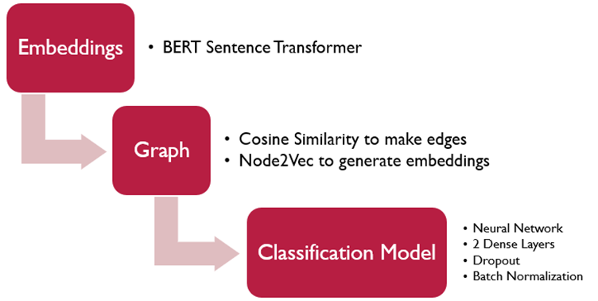
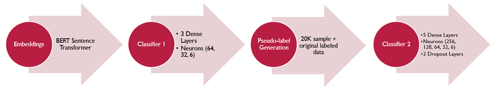

# :label: Topic Classification of UN Speeches

# :memo: Description
This project implements a semi-supervised approach to classify UN speeches. 

We have implemented this approach in 2 ways:

### 1. :globe_with_meridians: Graph Neural Network

The method is best illustrated with the following diagram:

- Generate word embeddings using BERT Sentence Transformer
- Generate a graph using cosine similarity for edges and sentence as the node
- Generate embeddings using Node2Vec
- Train a Neural Network to classify into topics using graph embeddings.

### 2. :brain: Neural Networks

The flowchart illustrating this approach:

- Generate word embeddings using BERT Sentence Transformer
- Train a Neural Network (N1) on these embeddings
- Pseudo-label data using N1
- Stack labelled and pseudo-labelled data
- Train a more complex Neural Network (N2)

Read the [Detailed Report](<Project Report.pdf>) for further information.

# :package: Dataset
The dataset for this project contains approximately 2 million sentences from UN General Debate speeches held from 1970 to 2016.

A sample of the dataset is saved as csv files in this repo. The original is publicly available on the [Harvard Dataverse](https://doi.org/10.7910/DVN/GSDZNV) and on my [GDrive](https://drive.google.com/drive/folders/1M8uLzfxbxJV2eEea2IADE5loXnN2RMSd?usp=sharing).

# :gear: Training Setup

1. Download the dataset from the above GDrive link and unzip it into `data` folder
2. Execute the `preprocess.py` file
3. Execute either:
   1. `approach1.py` to train the model using the first approach
   
      OR
   2. `approach2.py` to train the model using the second approach
   
# :rocket: Inference Demo
1. Download the contents from the above GDrive link
2. Put the csv files in the `data` folder
3. Put everything else in the `weights` folder
4. For inference, execute `inference2.py` to use the saved weights from the second approach. The program will ask for an input sentence and will output the predicted class.
   
# :warning: Requirements

- pandas==2.2.1
- numpy==1.26.4
- nltk==3.8.1
- maptlotlib==3.8.3
- sentence_transformers==2.5.1
- tensorflow==2.16.1
- gensim==4.3.2
- node2vec==0.4.6
  
# :bust_in_silhouette: Contributors

- Yash Jain
- Abhinav Shukla
